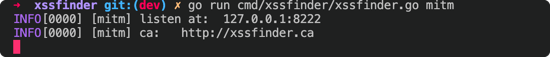
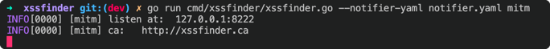
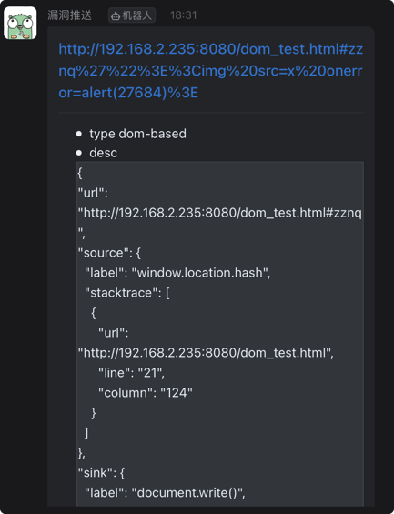
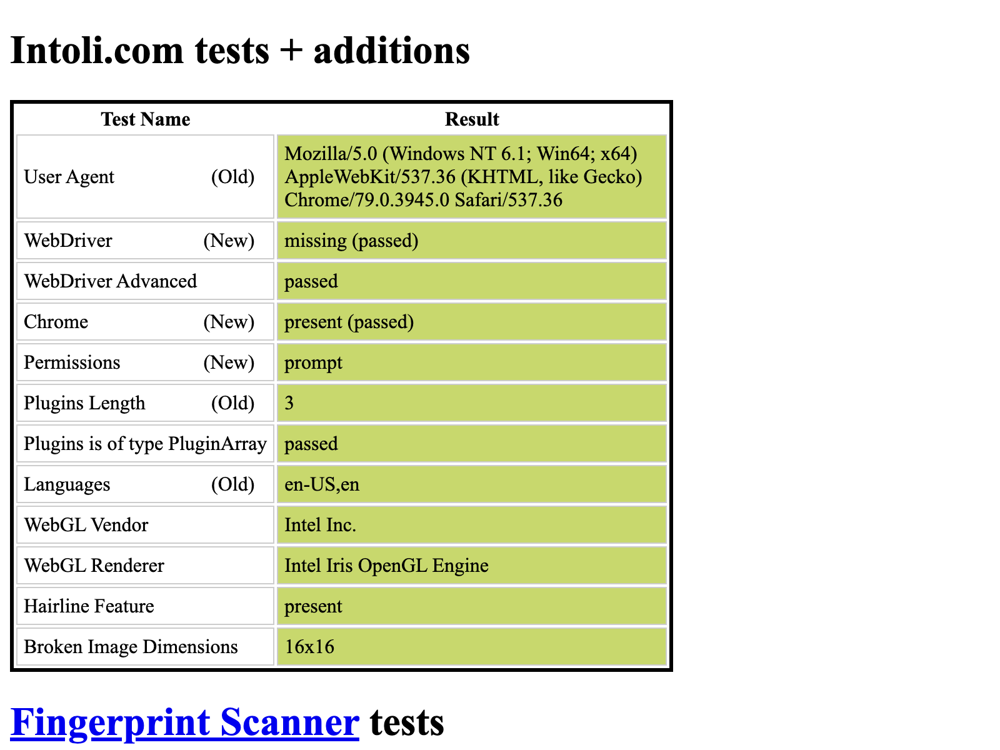

<div align="center" >
    
</div>

## xssfinder 是什么？

基于 `chrome headless` 的 XSS 漏洞发现工具。

它的主要特性有:
- 动态地语义分析网页中的`JavaScript`源码，Hook关键点，利用污点分析检出 Dom-Based XSS
- 极低的误报率：通过监听浏览器对话框弹出事件等进行验证。
- 启动模式：`被动代理`, (即将支持`主动爬虫扫描`)...
- 漏洞通知：`dingbot`, ...
## 安装
- Go Install

`go install github.com/Buzz2d0/xssfinder/cmd/xssfinder@latest`

- Github Release

前往 [releases](https://github.com/Buzz2d0/xssfinder/releases) 下载合适的版本然后从命令行运行即可。

## 用法

```bash
$ ./xssfinder

NAME:
   xssfinder - XSS discovery tool

USAGE:
   xssfinder [global options] command [command options] [arguments...]

VERSION:
   v0.1.0

COMMANDS:
   mitm     Passive agent scanning
   help, h  Shows a list of commands or help for one command

GLOBAL OPTIONS:
   --debug, -d             enable debug mode (default: false)
   --verbose, --vv         enable very-verbose mode (default: false)
   --notifier-yaml value   set notifier yaml configuration file
   --outjson               set logger output json format (default: false)
   --exec value, -e value  set browser exec path
   --noheadless            disable browser headless mode (default: false)
   --incognito             enable browser incognito mode (default: false)
   --proxy value           set proxy and all traffic will be routed from the proxy server through
   --help, -h              show help (default: false)
   --version, -v           print the version (default: false)
```

**使用示例：**

- mitm 模式
```bash
# 启动被动扫描(中间人)模式，默认监听  127.0.0.1:8222
# 下载并信任证书 http://xssfinder.ca
./xssfinder mitm
```


- 漏洞通知

[notifier.yaml](./tests/notifier-temp.yaml) 模版：

```yaml
dingbot:
  token: xxx
  secret: xxxx
```

```bash
# --notifier-yaml 指定通知机器人配置
./xssfinder --notifier-yaml notifier.yaml mitm
```



## Bypass headless detect


## 规划

- [x] 优化 cmd parse
- [x] 优化 Runner & Worker
- [ ] 支持检测反射XSS
- [ ] 支持 Docker 一键部署
- [ ] 主动爬虫扫描
- [ ] Webhook 提交任务


## Thx

- https://github.com/AsaiKen/dom-based-xss-finder
- https://github.com/boy-hack
- https://github.com/Qianlitp/crawlergo